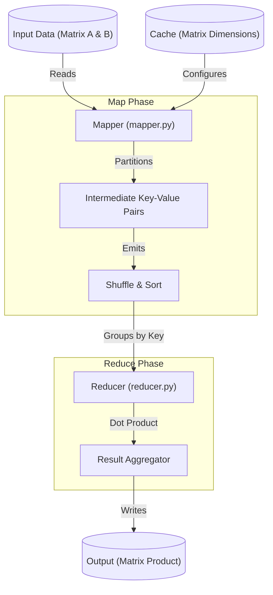

# Technical Specification: HADOOP - Matrix Multiplication

## Architectural Overview

**HADOOP** is a distributed computing implementation of Matrix Multiplication leveraging the **MapReduce** paradigm. The system is designed to handle large-scale datasets by partitioning matrix elements into intermediate key-value pairs, which are then processed in parallel to compute the final product.

### MapReduce Process Flow

---

## Technical Implementations

### 1. Mapper Phase: Data Partitioning
The `mapper.py` script identifies elements from Matrix A and Matrix B and maps them to their target result cell index `(i, j)`.
-   **Matrix A Expansion**: For each element `A[i, k]`, the mapper emits `((i, j), k, A[i, k])` for all possible columns `j` in the result matrix.
-   **Matrix B Expansion**: For each element `B[k, j]`, the mapper emits `((i, j), k, B[k, j])` for all possible rows `i` in the result matrix.
-   **Common Index**: The common index `k` ensures that elements corresponding to the same multiplication step are paired together during the shuffle phase.

### 2. Reducer Phase: Dot Product Calculation
The `reducer.py` script receives sorted intermediate pairs grouped by the result index `(i, j)`.
-   **Grouping**: Pairs belonging to the same `(i, j)` are batched into a list.
-   **Element Pairing**: It iterates through the list and pairs elements from Matrix A and Matrix B that share the same common index `k`.
-   **Summation**: The products of these pairs are summed to yield the dot product for the cell `Result[i, j]`.

---

## Technical Prerequisites

-   **Runtime**: Python 3.x.
-   **Environment**: Apache Hadoop (with Hadoop Streaming support) or local MapReduce simulators.
-   **Configuration**: `cache.txt` must define Matrix A rows and Matrix B columns for correct key mapping.

---

*Technical Specification | Computer Engineering Project | Version 1.0*
